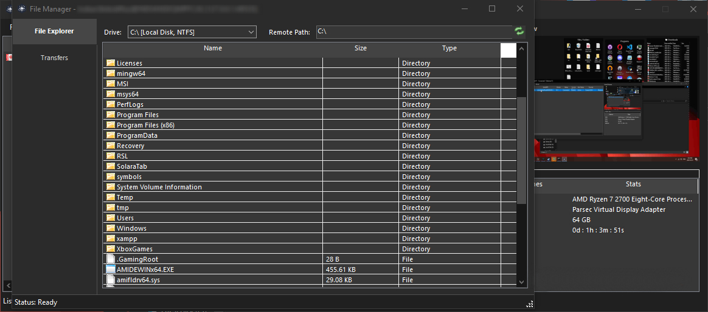

# Quasar

**Free, Open-Source Remote Administration Tool for Windows**

Quasar is a fast and light-weight remote administration tool coded in C#. The usage ranges from user support through day-to-day administrative work to employee monitoring. Providing high stability and an easy-to-use user interface, Quasar is the perfect remote administration solution for you.

Please check out the [Getting Started](https://github.com/Quasar-Continuation/Quasar-Modded/wiki/Getting-Started) guide.

---

## 📸 Screenshots

### Remote Shell

### Remote Desktop

### Remote Files

---

## ✨ Features

- **TCP network stream** (IPv4 & IPv6 support)
- **Fast network serialization** (Protocol Buffers)
- **Encrypted communication** (TLS)
- **UPnP Support** (automatic port forwarding)
- **Task Manager**
- **File Manager**
- **Startup Manager**
- **Remote Desktop**
- **Remote Shell**
- **Remote Execution**
- **System Information**
- **Registry Editor**
- **System Power Commands** (Restart, Shutdown, Standby)
- **Keylogger** (Unicode Support)
- **Reverse Proxy** (SOCKS5)
- **Password Recovery** (Common Browsers and FTP Clients)
- **... and many more!**

---

## 📥 Download

- **[Latest stable release](https://github.com/Quasar-Continuation/Quasar-Modded/releases)** (recommended)
- **[Latest development snapshot](https://ci.appveyor.com/project/MaxXor/quasar)**

---

## 🖥️ Supported Runtimes and Operating Systems

- **.NET Framework 4.5.2 or higher**
- **Supported operating systems** (32- and 64-bit):
  - Windows 11
  - Windows Server 2022
  - Windows 10
  - Windows Server 2019
  - Windows Server 2016
  - Windows 8/8.1
  - Windows Server 2012
  - Windows 7
  - Windows Server 2008 R2
- For older systems, please use [Quasar version 1.3.0](https://github.com/Quasar-Continuation/Quasar-Modded/releases/tag/v1.3.0.0).

---

## 🛠️ Compiling

1. Open the project `Quasar.sln` in **Visual Studio 2019+** with installed **.NET desktop development features**.
2. [Restore the NuGET packages](https://docs.microsoft.com/en-us/nuget/consume-packages/package-restore).
3. Once all packages are installed, compile the project by clicking `Build` at the top or pressing `F6`.
4. The resulting executables can be found in the `Bin` directory.

### Building a Client

| **Build Configuration** | **Usage Scenario** | **Description** |
|--------------------------|--------------------|-----------------|
| **Debug configuration**  | Testing            | The pre-defined [Settings.cs](/Quasar.Client/Config/Settings.cs) will be used. Edit this file before compiling the client. You can execute the client directly with the specified settings. |
| **Release configuration**| Production         | Start `Quasar.exe` and use the client builder. |

---

## 🤝 Contributing

See [CONTRIBUTING.md](CONTRIBUTING.md) for details on how to contribute to Quasar.

---

## 🗺️ Roadmap

Check out our [ROADMAP.md](ROADMAP.md) to see what's planned for future releases.

---

## 📚 Documentation

Visit the [wiki](https://github.com/Quasar-Continuation/Quasar-Modded/wiki) for usage instructions and other documentation.

---

## 📜 License

Quasar is distributed under the **[Apache 2.0 License](LICENSE)**.  
Third-party licenses are located [here](Licenses).

---

## 🙏 Thank You!

I really appreciate all kinds of feedback and contributions. Thanks for using and supporting Quasar!