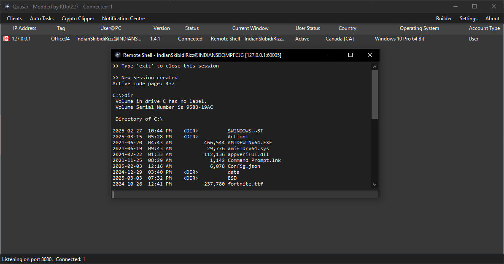
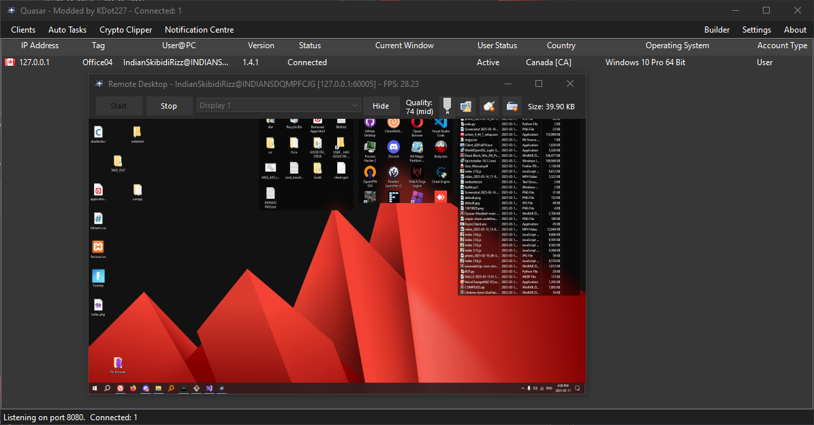
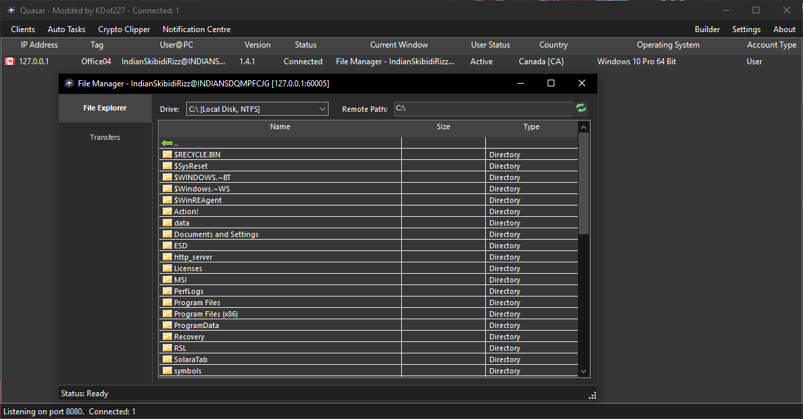

# Pulsar

> **A Free, Open-Source Remote Administration Tool for Windows**

Pulsar is a lightweight, fast, and powerful remote administration tool written in C#. Whether you're providing user support, handling daily admin tasks, or monitoring endpoints, Pulsar offers high stability and an intuitive interface—making it your go-to solution for remote administration.

---

## 📖 Table of Contents
- [Need Help or Suggestions?](#-need-help-or-want-to-offer-suggestions)
- [Screenshots](#-screenshots)
- [Key Features](#-key-features)
- [Download](#-download)
- [Getting Started](#-getting-started)
- [Supported Platforms](#-supported-platforms)
- [How to Compile](#-how-to-compile)
- [Contributing](#-contributing)
- [Roadmap](#-roadmap)
- [License](#-license)
- [Contributors](#-contributors)
- [Security Notice](#-security-notice)
- [Thank You](#-thank-you)

---

## 📚 Need Help or Want to Offer Suggestions?

Join our [Telegram channel](https://t.me/SomaliDevs) for updates, discussions, and support from the development team and community. \
Or our  [Discord Channel](https://discord.gg/rKDJ6A78Yu)
---

## 📸 Screenshots

| **Remote Shell**                  | **Remote Desktop**                | **File Manager**                  |
|-----------------------------------|-----------------------------------|-----------------------------------|
|  |  |  |

---

## ✨ Key Features

- 🌐 **TCP Network Streams** — IPv4 & IPv6 support for robust connectivity
- ⚡ **Fast Serialization** — Uses Protocol Buffers for efficient data transfer
- 🔒 **Encrypted Communication** — Secure TLS encryption for all traffic
- 📡 **UPnP Support** — Automatic port forwarding for easy setup
- 🖥️ **HVNC** — Hidden Virtual Network Computing for stealthy remote access
- 🕵️‍♂️ **Kematian Gatherer Built-in** — Integrated credential recovery
- 📋 **Task Manager** — View and manage remote processes
- 🗂️ **File Manager** — Browse, upload, and download files remotely
- ⏳ **Startup Manager** — Control startup programs
- 🖧 **Remote Desktop** — Full-featured remote desktop control
- 💻 **Remote Shell** — Command-line access to remote systems
- ⚙️ **Remote Execution** — Run commands and scripts remotely
- ℹ️ **System Information** — Gather detailed system info
- 🔧 **Registry Editor** — Edit the Windows registry remotely
- 🔋 **System Power Commands** — Restart, shutdown, or standby
- ⌨️ **Keylogger** — Unicode-supporting keylogger
- 🌉 **Reverse Proxy** — SOCKS5 proxy support
- 🔑 **Password Recovery** — Extract browser & FTP client passwords
- 🔐 **Escalate / De-escalate Permissions** — Manage privilege levels
- 🚫 **Block IPs** — Block unwanted connections
- 📩 **Telegram Notifications** — Get alerts via Telegram
- 🛡️ **Built-in Obfuscator & Packer** — Protect your builds
- 🛑 **Anti-VM / Anti-Debug** — Evade analysis environments
- 🖼️ **Screen Corrupter / Illuminati** — Fun/experimental features
- 📷 **Webcam Capture** — Capture images from remote webcams
- 🎤 **Microphone Capture** — Record audio from remote microphones
- 💬 **Chat** — Real-time chat with remote users
- 📝 **Remote Script Execution** — Execute PowerShell, Batch, or custom scripts
- **…and much more!**

---

## 📥 Download

- **[Latest Stable Release](https://github.com/Quasar-Continuation/Pulsar/releases)**
<!-- - **[Latest Development Snapshot](https://ci.appveyor.com/project/MaxXor/pulsar)** -->

---

## 🚀 Getting Started

1. **Download** the latest release from above.
2. **Extract** the files to a folder of your choice.
3. **Run** `Pulsar.exe` (server) or build the client as needed.
4. **Configure** your settings using the built-in client builder.

> **Note:** Pulsar is intended for legitimate administrative and educational use only. Always ensure you have permission to access remote systems.

---

## 🖥️ Supported Platforms

- **Runtime:** .NET Framework 4.5.2 or higher
- **Operating Systems** (32- and 64-bit):
  - Windows 11
  - Windows Server 2022
  - Windows 10
  - Windows Server 2019
  - Windows Server 2016
  - Windows 8/8.1
  - Windows Server 2012
  - Windows 7
  - Windows Server 2008 R2

---

## 🛠️ How to Compile

1. Open `Pulsar.sln` in **Visual Studio 2019+** with **.NET Desktop Development** installed.
2. [Restore NuGet Packages](https://docs.microsoft.com/en-us/nuget/consume-packages/package-restore).
3. Build the project (`Build` > `F6`).
4. Find executables in the `Bin` directory.

### Client Build Options

| **Configuration** | **Use Case**    | **Details**                                                                 |
|-------------------|-----------------|-----------------------------------------------------------------------------|
| **Debug**         | Testing         | Uses pre-defined [Settings.cs](/Pulsar.Client/Config/Settings.cs). Edit before compiling. |
| **Release**       | Production      | Run `Pulsar.exe` and use the client builder for custom settings.           |

> **Troubleshooting:**
> - Ensure all dependencies are restored via NuGet.
> - If you encounter build errors, check your .NET Framework version and Visual Studio workloads.

---

## 🤝 Contributing

Want to help? See [CONTRIBUTING.md](CONTRIBUTING.md) for guidelines. All contributions, bug reports, and feature requests are welcome!

---

## 🗺️ Roadmap

Curious about the future? Check out [ROADMAP.md](ROADMAP.md).

---

## 📜 License

Pulsar is licensed under the **[MIT](LICENSE)**. Third-party licenses are available [here](Licenses).

---

## 😎 Contributors

- **[KingKDot](https://github.com/KingKDot)** – Lead Developer
- **[Twobit](https://github.com/officialtwobit)** – Multi-Feature Wizard
- **[Lucky](https://t.me/V_Lucky_V)** – HVNC Specialist
- **[fedx](https://github.com/fedx-988)** – README Designer & Discord RPC
- **[Ace](https://github.com/Knakiri)** – HVNC Features & WinRE Survival
- **[Java](https://github.com/JavaRenamed-dev)** – Feature Additions
- **[Body](https://body.sh)** – Obfuscation
- **[cpores](https://github.com/vahrervert)** – VNC Drawing, Favorites, Overlays
- **[Rishie](https://github.com/rishieissocool)** – Gatherer Options
- **[jungsuxx](https://github.com/jungsuxx)** – HVNC Input & Code Simplification
- **[MOOM aka my lebron](https://github.com/moom825/)** – Inspiration & Batch Obfuscation
- **[Poli](https://github.com/paulmaster59/)** - Discord Server & Custom Pulsar Crypter
- **[Deadman](https://github.com/DeadmanLabs)** - Memory Dumping and Shellcode Builder

---

## 🛡️ Security Notice

Pulsar is a powerful tool intended for ethical, authorized use only. Unauthorized use against systems you do not own or have explicit permission to control is illegal and unethical. The developers are not responsible for misuse.

---

## 🙏 Thank You!

We appreciate all feedback and contributions. Thanks for using and supporting Pulsar! \
\
Please give me star for hard work 🙏
