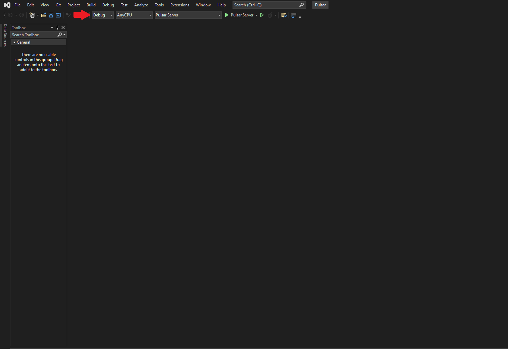
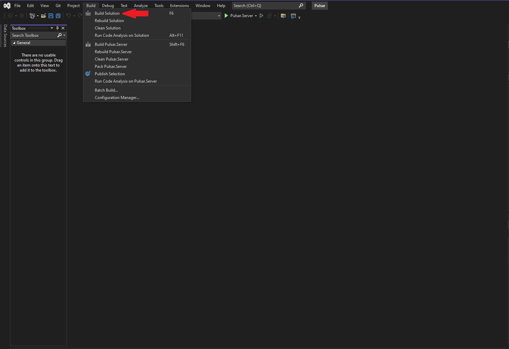
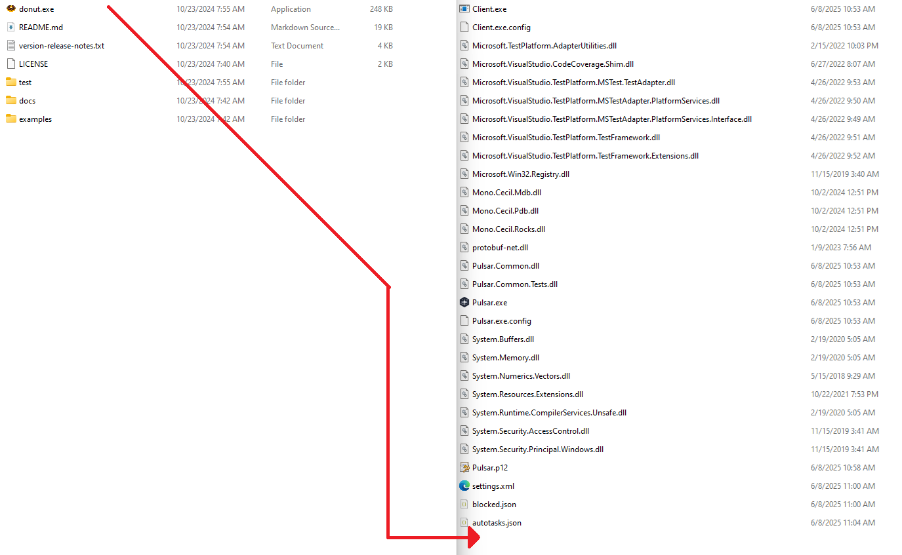

# FAQ

## Table of Contents

* [Shellcode Not Working](#shellcode-not-working)

  * [Enabling Shellcode Outputs](#enabling-shellcode-outputs)
  * [Alternative Build Process](#alternative-build-process)

---

## Shellcode Not Working

If shellcode generation or execution isn't producing the expected outputs, it often means the project wasn't built with the shellcode feature enabled. Follow the steps below to ensure your build configuration includes Donut support.

### Enabling Shellcode Outputs

1. **Open the solution**: Launch Visual Studio and open `Pulsar.sln`.

   

2. **Select build configuration**:

   * Locate the configuration selector on the toolbar (usually reads `Debug` or `Release`).
   
   
   
   * Change it to **ReleaseWithDonut**.

   

3. **Build the solution**:

   * Go to `Build → Build Solution` or press `Ctrl + Shift + B`.

   

4. **Verify outputs**:

   * After a successful build, navigate to `bin/Release`.
   * Confirm that the shellcode converter files (donut.exe) are present.

### Alternative Build Process

If you cannot use Visual Studio or the standard build fails, enable shellcode outputs manually:

1. **Download Donut**:

   * Visit the [Donut Releases page](https://github.com/TheWover/donut/releases).
   * Download the latest `donut.exe` for your operating system.

   

2. **Extract the binary**:

   * Unzip or extract the downloaded archive to locate `donut.exe`.

3. **Copy to Pulsar output**:

   * Place `donut.exe` into your Pulsar build directory: `bin/ReleaseWithDonut`.

   

4. **Verify manual setup**:

   * Check Pulsar if the build shellcode artifact is enabled.

---